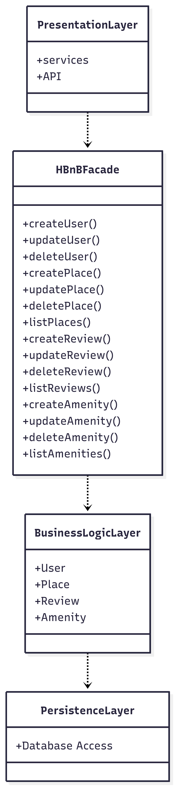
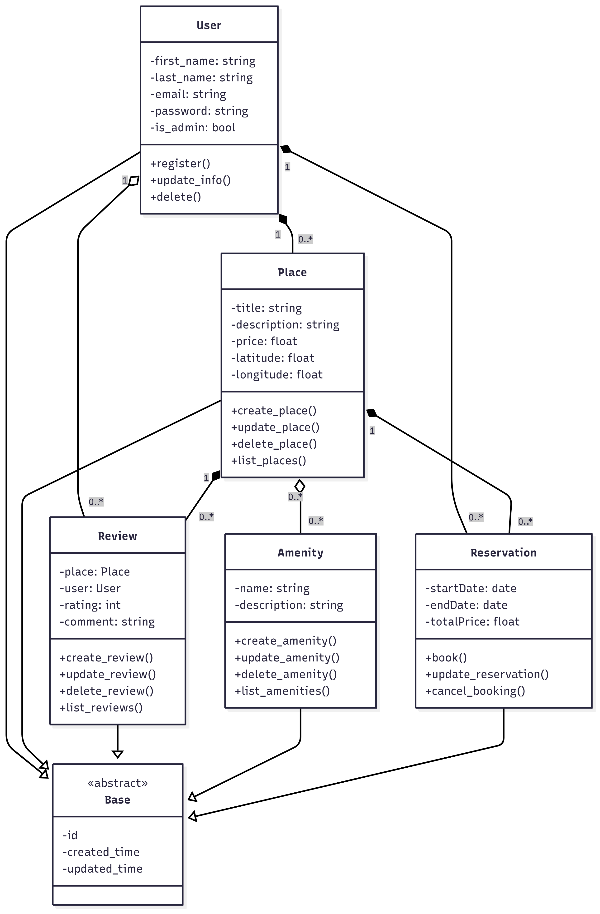
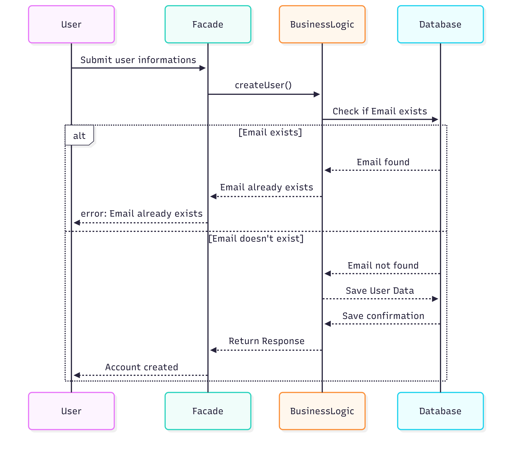
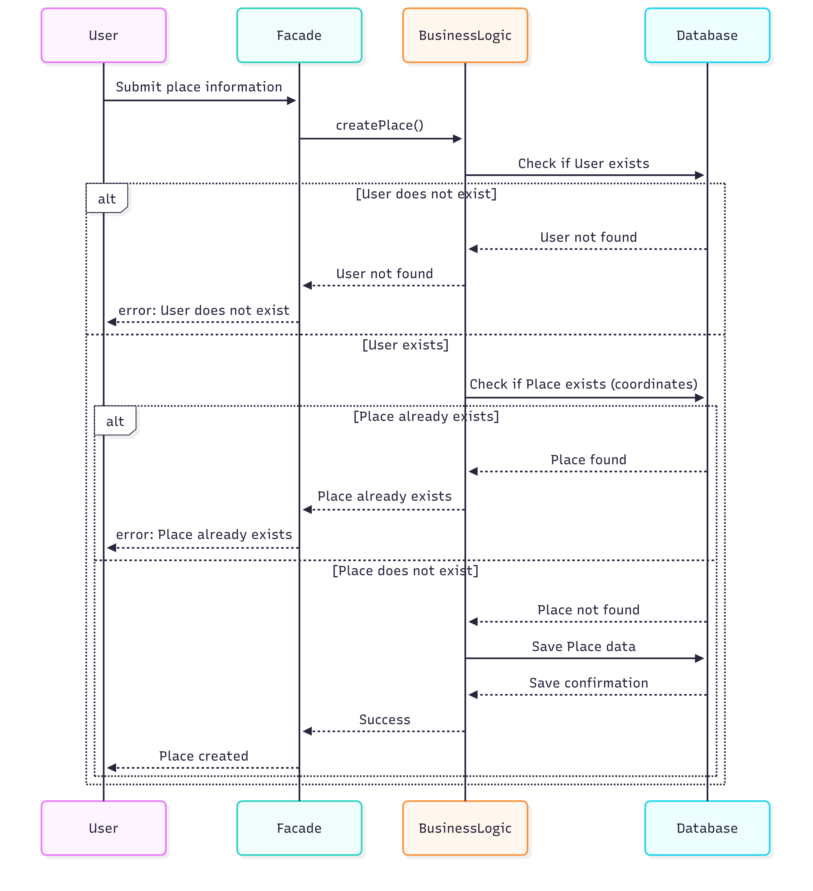
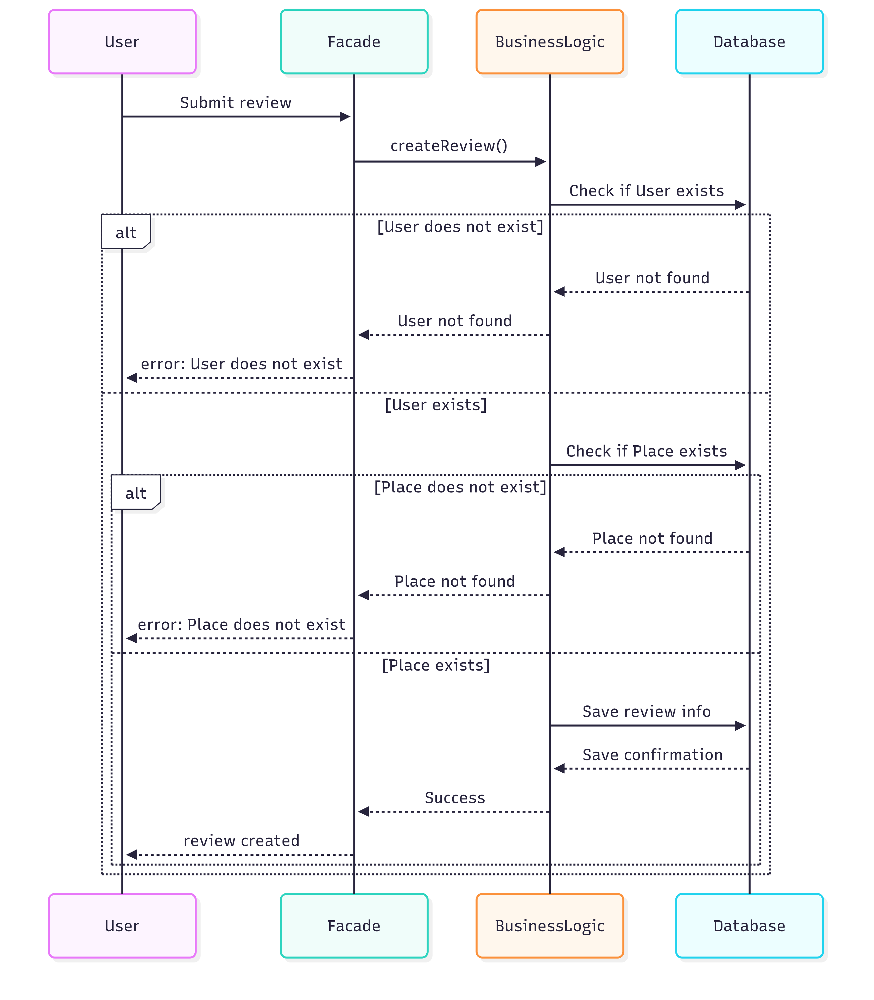
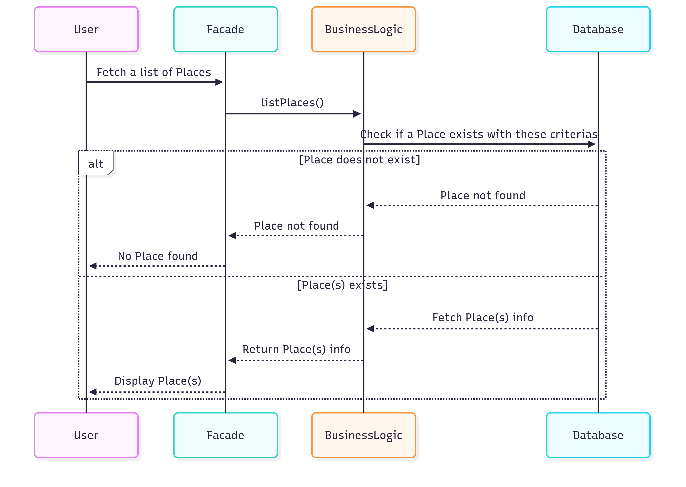

The goal of the HBnB project is to recreate a simple AirBnB website.
You'll be able to create an account, search places, make bookings and publish reviews. More options could be added later like payment for instance.

Please find below the Package Diagram, the Class Diagram and 4 Sequence Diagrams for a better understanding of the architecture as well as the information flow.

1- High-Level Package Diagram

The architecture is divided in 3 layers: the Presentation Layer, the Business Logic Layer and the Persistence Layer. There is also a Facade between the first two layers to simplify the system use.

- Presentation Layer: All the actions that a user can make on the platform (Services and API).

- Facade: Entry point of the system. Any API call goes through the Facade. Its goal is also to centralise, for instance one call can use many classes.
You can find in the diagram a non-exhaustive list of available functions.

- Business Logic Layer: Layer including the base classes of the system: User, Place, review and Amenity. Thanks to these classes we can make a basic platform where a user can create an account, list a place, publish review, and add amenities for instance.
Please note that many classes could be added later like Photos, Payment,... but this is just the base idea.

- Persistence Layer: Can fetch and send data from or to the DataBase.

Please find below the Package Diagram of the 3 Layers system. The relationship between the layers is dependency because layer depends on the layer below it until the DataBase.

2- Class Diagram for Business Logic Layer

The Class Diagram includes the 4 base classes mentionned above (User, Place, Review and Amenity) but also a Reservation class. Additionnally, all these classes inherits from the Base class that provides an id, a created_time and an updated_time.

Now let's dive into each class:

- User class:
	* Attributes: . first_name
				. last_name
				. email
				. password
				. is_admin (boolean)
	* Methods:
				. register()
				. update_info()
				. delete()
The User class has 2 types of relations with the other classes:
	Composition: with the Place and Reservation classes because a place or a reservation have to come from a registered user.

	Aggregation: with the Review class. It means that a review can exist even if a user is deleted. 

The multiplicity is always the same: all of the above need only one user to exist, however one user can have any number of reviews, places or reservations.

- Place class:
	* Attributes: title, description, price(float), latitude(float), longitude(float)
	* Methods: create_place(), update_place(), delete_place(), list_places()
The Place class has 2 types of relations with the other classes:
	Composition: with the Review and Reservation classes because a review or a reservation have to come from a specific place.

	Aggregation: with the Amenity class. It means that an amenity is independent from a place.

- Review class:
	* Attributes: place: Place (from the Place class), user: User (from the User class), rating: int, comment
	* Methods: create_review(), update_review(), delete_review(), list_reviews()
Cf the User and Place classes for the different relations and the multiplicity.

- Amenity class:
	* Attributes: name, description

	* Methods: create_review(), update_review(), delete_review(), list_reviews()
Cf the Place classe for the relation and the multiplicity.

- Reservation class:
	* Attributes: startDate: date, endDate: date, totalPrice: float

	* Methods: book(), update_reservation(), cancel_booking()
Cf the User and Place classes for the different relations and the multiplicity.

- Base class (abstract):
	* Attributes: id, created_time, updated_time
Abstract class giving its attributes to all the other classes.

3- Sequence Diagrams for API Calls

Here are 4 Sequence diagrams representing the main API calls.

- User Registration: a user submits his informations, then the facade calls createUser() znd the BusinessLogic checks with the Databse if the email already exists. If it does an error message will be sent to the user. Otherwise, the user informations will be saved in the Database and a message "Account created" is sent to the user.

- Place Creation: a user submits all the information of a place to create. The facade calls createPlace() using the BusinessLogic layer that will check with the Database if the user exists. An error message is sent if the user doesn't have an account, otherwise the BusinessLogic will check with the Databse if the place exists. If it does an error message is sent to the user, otherwise the place informations will be saved in the Databse.

- Review Submission: a user submits a review. The facade calls createReview() then the BusinessLogic checks with the Database if the user exists. If it doesn't, an error message is sent ot the user. Otherwise the BusinessLogic checks if the place exists. An error message is sent if the place doesn't exist. If everything is good, the review information is saved in the Databse.

- Fetching a list of places: a user creates a research to find a place with specific criterias. The facade calls listPlaces() and the BusinessLogic checks if a place exists with these criterias. If it doesn't, an empty list is sent to the user, otherwise the BusinessLogic fetches the place info and a list containing all the specific places is sent to the user.

